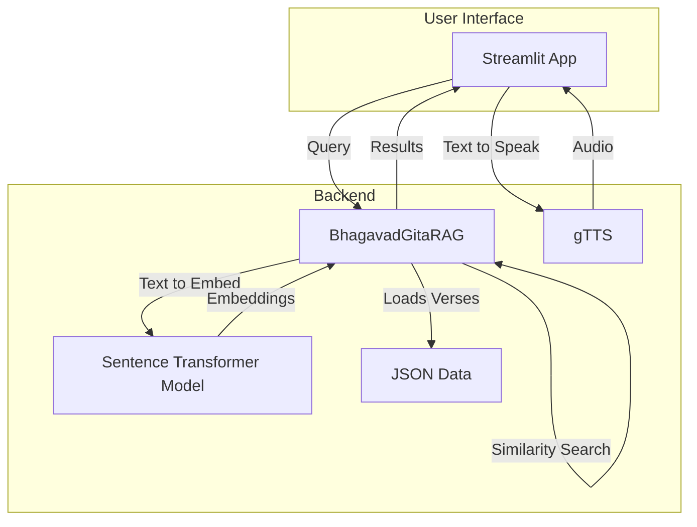

```mermaid
graph TD
    subgraph User Interface
        A[Streamlit App]
    end

    subgraph Backend
        B[BhagavadGitaRAG]
        C[Sentence Transformer Model]
        D[JSON Data]
        E[gTTS]
    end

    A -- Query --> B
    B -- Text to Embed --> C
    B -- Loads Verses --> D
    C -- Embeddings --> B
    B -- Similarity Search --> B
    B -- Results --> A
    A -- Text to Speak --> E
    E -- Audio --> A
```
